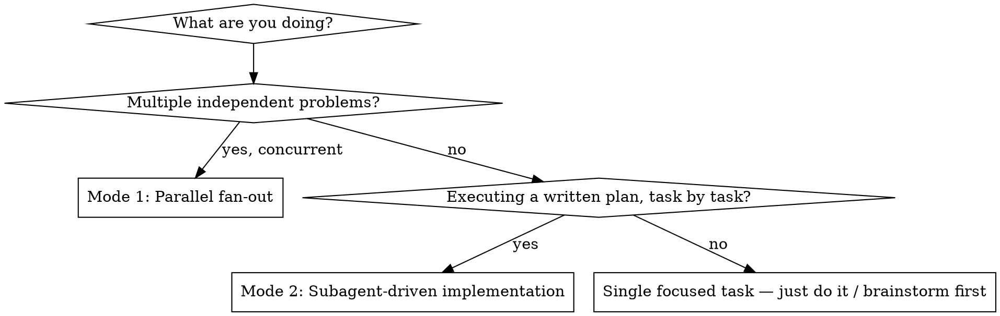
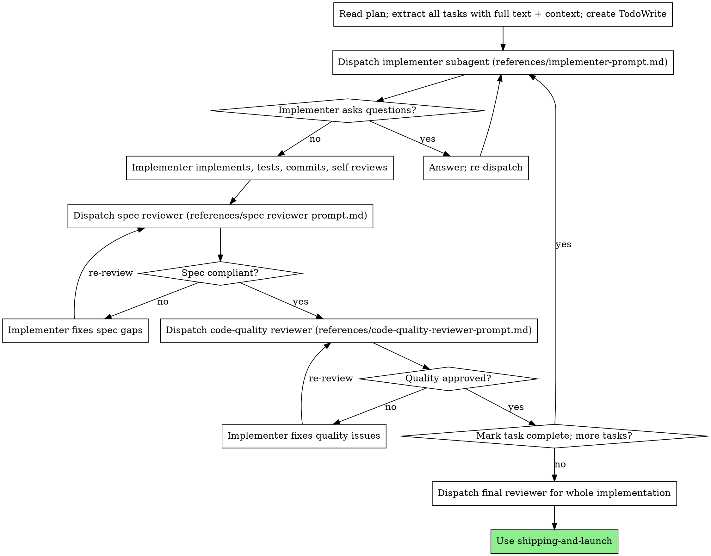

# Subagent Orchestration

Delegate tasks to specialized subagents with **isolated context**. You craft exactly the
instructions and context each subagent needs — they never inherit your session history. This
keeps each subagent focused and preserves your own context for coordination.

This skill covers two complementary modes. Pick the one that matches the work.

## Which mode?



- **Mode 1 — Parallel fan-out:** several *independent* problems (different test files, subsystems,
  bugs) that can be investigated/fixed at the same time without shared state.
- **Mode 2 — Subagent-driven implementation:** a written plan with mostly independent tasks that
  you execute one at a time in the current session, with review gates after each.

---

## Mode 1 — Parallel Fan-Out

**Core principle:** Dispatch one agent per independent problem domain. Let them work concurrently.

When you have multiple unrelated failures, investigating them sequentially wastes time. Each
investigation is independent and can happen in parallel.

**Use when:**
- 3+ test files failing with different root causes
- Multiple subsystems broken independently
- Each problem can be understood without context from the others
- No shared state between investigations

**Don't use when:**
- Failures are related (fixing one might fix others) — investigate together first
- Understanding requires seeing the whole system state
- Agents would interfere (editing the same files / using the same resources)
- You don't know what's broken yet (exploratory debugging)

### The pattern

1. **Identify independent domains.** Group failures by what's broken (e.g. tool-approval flow vs.
   batch completion vs. abort logic). Each domain must be fixable without the others' context.
2. **Create focused agent tasks.** Each agent gets: a specific scope (one file/subsystem), a clear
   goal, explicit constraints, and a defined expected output.
3. **Dispatch in parallel.** Launch all agents in one batch so they run concurrently.
4. **Review and integrate.** Read each summary, check for conflicts (did two agents touch the same
   code?), run the full suite, integrate.

### Agent prompt structure

Good agent prompts are **focused** (one problem domain), **self-contained** (all context needed —
paste error messages and test names), and **specific about output** (what should it return?).

```markdown
Fix the 3 failing tests in src/agents/agent-tool-abort.test.ts:
1. "should abort tool with partial output capture" — expects 'interrupted at' in message
2. "should handle mixed completed and aborted tools" — fast tool aborted instead of completed
3. "should properly track pendingToolCount" — expects 3 results but gets 0

These look like timing/race conditions. Your task:
1. Read the test file and understand what each test verifies
2. Identify root cause — timing issue or real bug?
3. Fix by replacing arbitrary timeouts with event-based waiting, or fixing the bug.
Do NOT just increase timeouts — find the real issue.
Return: summary of root cause and what you changed.
```

### Common mistakes

| ❌ Avoid | ✅ Do |
|---------|------|
| "Fix all the tests" (too broad — agent gets lost) | "Fix agent-tool-abort.test.ts" (focused scope) |
| "Fix the race condition" (no location) | Paste the error messages and test names |
| No constraints (agent refactors everything) | "Do NOT change production code" / "fix tests only" |
| "Fix it" (vague output) | "Return summary of root cause and changes" |

---

## Mode 2 — Subagent-Driven Implementation

Execute a plan by dispatching a **fresh subagent per task**, with a two-stage review after each:
**spec compliance first, then code quality.**

**Core principle:** Fresh subagent per task + two-stage review (spec → quality) = high quality,
fast iteration, no context pollution.

### The process



### Prompt templates (bundled in `references/`)

- `references/implementer-prompt.md` — dispatch the implementer subagent
- `references/spec-reviewer-prompt.md` — dispatch the spec-compliance reviewer
- `references/code-quality-reviewer-prompt.md` — dispatch the code-quality reviewer

### Model selection

Use the least powerful model that can handle each role, to conserve cost and increase speed.

- **Mechanical tasks** (isolated functions, clear spec, 1–2 files) → fast, cheap model. Most
  implementation tasks are mechanical when the plan is well-specified.
- **Integration / judgment tasks** (multi-file coordination, pattern matching, debugging) → standard model.
- **Architecture, design, and review tasks** → the most capable available model.

### Handling implementer status

Implementer subagents report one of four statuses:

- **DONE** — proceed to spec compliance review.
- **DONE_WITH_CONCERNS** — read the concerns first. If they affect correctness or scope, address
  them before review; if they're observations, note and proceed.
- **NEEDS_CONTEXT** — provide the missing information and re-dispatch.
- **BLOCKED** — assess: context problem → give more context, same model; needs more reasoning →
  re-dispatch with a more capable model; task too large → break it up; plan is wrong → escalate to
  the human.

**Never** ignore an escalation or force the same model to retry without changing anything.

### Red flags — never

- Start implementation on main/master without explicit user consent
- Skip a review (spec compliance OR code quality), or proceed with unfixed issues
- Start code-quality review before spec compliance is ✅ (wrong order)
- Dispatch multiple implementer subagents in parallel for coupled work (conflicts)
- Make the subagent read the plan file (provide the full task text instead)
- Skip scene-setting context, or ignore the subagent's questions
- Accept "close enough" on spec compliance, or skip a re-review after fixes
- Let the implementer's self-review replace actual review (both are needed)

---

## Integration with other skills

- **plan** — produces the written plan that Mode 2 executes.
- **git-workflow** — set up an isolated branch/worktree before starting Mode 2.
- **code-review** — the review template/discipline the reviewer subagents apply.
- **tdd-workflow** — subagents follow test-driven development for each task.
- **shipping-and-launch** — complete the work after all tasks pass.

## Rationalizations

| Excuse | Rebuttal |
|--------|----------|
| "I'll just fix these failures one by one" | Independent failures fan out — Mode 1 solves them concurrently. |
| "Reviews slow me down" | Two-stage review catches over/under-building early; cheaper than debugging later. |
| "I'll let the subagent read the plan itself" | Provide the full task text — reading the plan wastes context and invites drift. |
| "Spec review is close enough, ship it" | A spec reviewer that found issues = not done. Fix, then re-review. |
